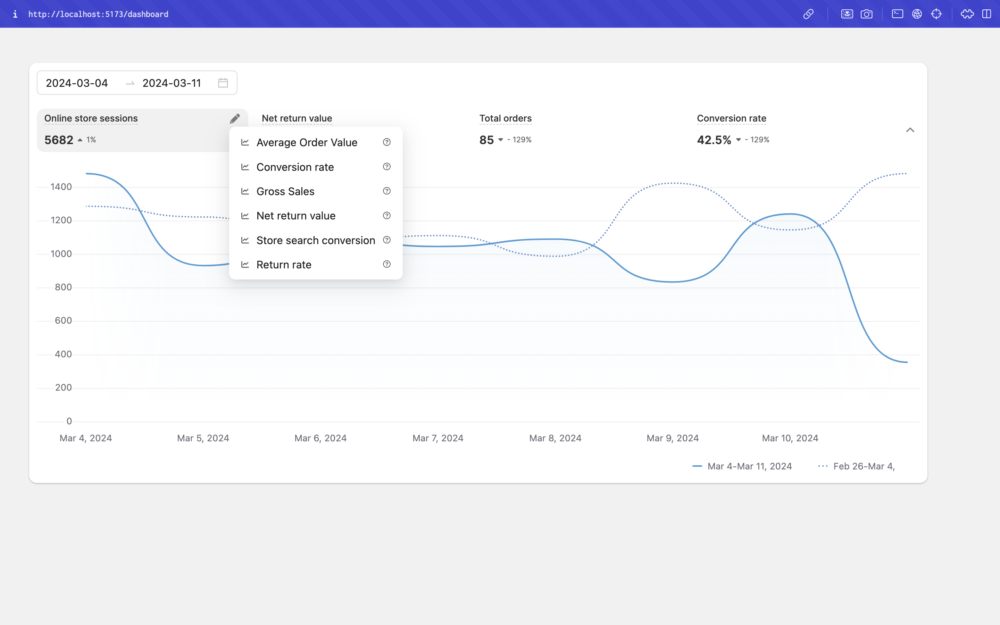
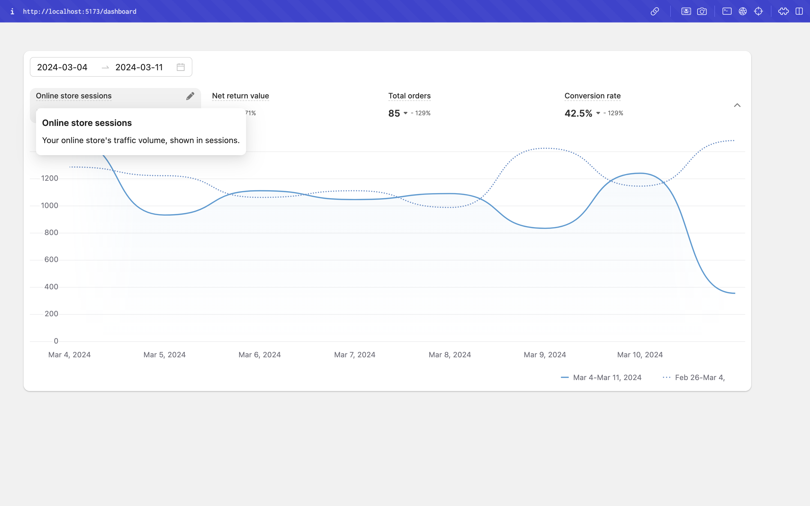
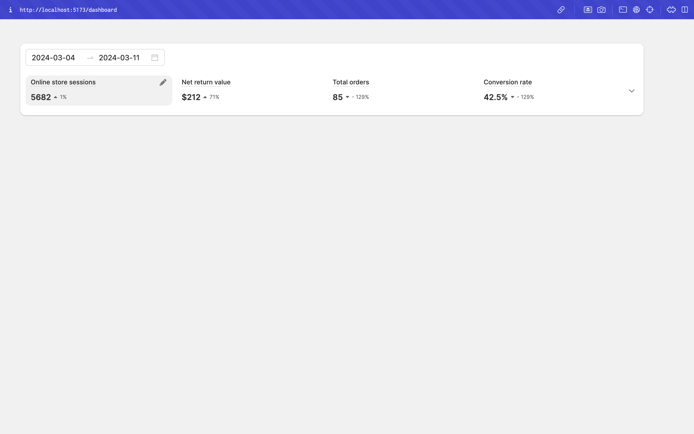
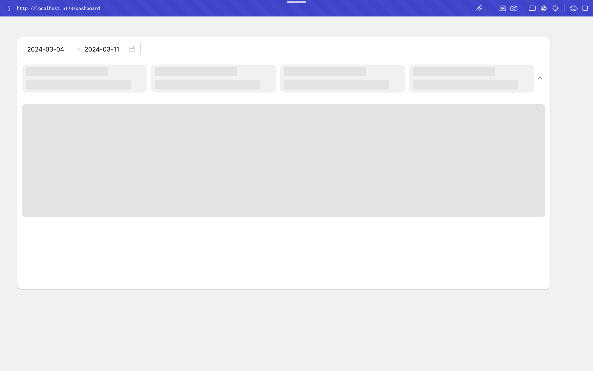

<div align="center" style="margin: 30px;">

<h1>Marble AI dashboard</h1>

<p>This project utilizes the following libraries:</p>

<h2>@shopify/polaris</h2>
<p>@shopify/polaris is used for plotting the data.</p>

<h2>@antd</h2>
<p>@antd library is used for implementing the date range picker.</p>

<h2>Data Modification</h2>
<p>The existing data has been modified to suit the requirements of PolarisVizLineChart for plotting two data based on the timeline.</p>

<br />
<br />

## Quick Start

Once the setup is complete, navigate to the project folder and start your project with:

```
npm run dev
```

Your application will be accessible at http://localhost:5173

<div>




</div>

### Resources

Refer to [daisyUI docs](https://daisyui.com/docs/install/) for more information.

Refer to complete CRUD app [tutorial](https://refine.dev/docs/tutorial/introduction/index/) to learn more about refine.
